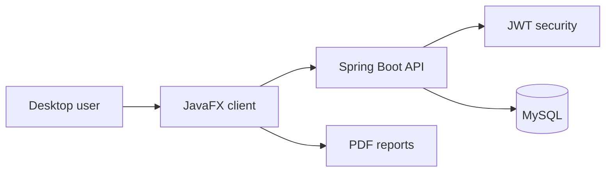

# FinTrack

Team-built personal finance tracker with a Spring Boot REST API and JavaFX desktop client.

[Detailed demo](https://youtu.be/d7Ji9XbgX3I) · [Short demo](https://youtu.be/ALf5bgb_v7Q)


FinTrack brings authentication, transactions, budgets, savings goals, reporting, and analytics into one desktop workflow. The project demonstrates a real client/server boundary: a JavaFX application consumes a secured Spring Boot API backed by relational persistence and database migrations.

## Engineering proof

| Area | Implementation |
| --- | --- |
| API | Spring Boot 3.3.9, Java 17, Spring Web, validation |
| Security | Spring Security, JWT, OAuth2 client support |
| Data | Spring Data JPA, MySQL, Flyway, plus MongoDB dependency support |
| Desktop | JavaFX 23, FXML, Maven, iText |
| Workflows | Transactions, budgets, savings goals, analytics, and reports |
| Team delivery | Backend, frontend, database, navigation, and UX ownership documented below |

## Product capabilities

- Account registration, login, and secured API access
- Transaction creation and categorization
- Budget tracking and savings goals
- Dashboard analytics and charts
- Report generation and export workflows
- Theme-aware JavaFX interface with reusable navigation
- Database migration support with Flyway available for controlled deployments

## Architecture



## Screens

| Dashboard | Transactions |
| --- | --- |
|  |  |
| Budgets | Reports |
|  |  |

## Run locally

Prerequisites: Java 17+ for the backend, a JDK compatible with the JavaFX client, Maven, and MySQL.

### Backend

```bash
cd backend
./mvnw spring-boot:run
```

Set `DB_URL`, `DB_USERNAME`, and `DB_PASSWORD` before launch. Local defaults are provided for the URL and username, but no password is committed. Flyway is disabled by default in the current configuration; enable it with `FLYWAY_ENABLED=true` only after reviewing the migrations for your database.

### Desktop client

```bash
cd frontend
./mvnw javafx:run
```

Point the client configuration at the running backend service.

## Test and package

```bash
cd backend && ./mvnw test
cd frontend && ./mvnw test
cd frontend && ./mvnw package
```

## Repository map

```text
FinTrack/
├── backend/          Spring Boot API, security, persistence, migrations
├── frontend/         JavaFX/FXML desktop client
├── assets/           Screenshots and demo media
└── README.md         Product, setup, and ownership overview
```

## Team ownership

- **Muhammad A. Imran** — Spring Boot backend across authentication, budgets, transactions, and savings; JavaFX integration; Spring Security and API error handling; integration on `merge_frontend`.
- **Dieunie Gousse** — Lead frontend development; FXML screens, themes, splash/branding, GUI controllers, navigation, UX, and accessibility consistency.
- **William Jijon** — Azure MySQL schema, budget APIs, and backend data/security work.
- **Jason M. Maldonado** — Scene switching and sidebar navigation, dashboard charts, reusable UI components, and integration work.

## License

No license file is currently included. Unless a license is added, standard copyright restrictions apply.
